# 🛒 Walmart Compass - Documentación Consolidada Bilingüe
# 🛒 Walmart Compass - Consolidated Bilingual Documentation

## 📋 **Resumen Ejecutivo / Executive Summary**

**ESPAÑOL:**
Walmart Compass es un sistema innovador de navegación en tienda impulsado por IA que revoluciona la experiencia de compra para los clientes de Walmart México. Nuestra solución combina tecnologías de vanguardia incluyendo posicionamiento UWB, procesamiento de lenguaje natural e inteligencia artificial para ayudar a los clientes a encontrar productos rápidamente y navegar las tiendas de manera eficiente.

**ENGLISH:**
Walmart Compass is an innovative AI-powered in-store navigation system that revolutionizes the shopping experience for Walmart México customers. Our solution combines cutting-edge technologies including UWB positioning, natural language processing, and artificial intelligence to help customers find products quickly and navigate stores efficiently.

**Demo en Vivo / Live Demo:** https://walmart-hackathon-two.vercel.app  
**Repositorio / Repository:** https://github.com/angelundeveloped/walmart_hackathon

---

## 🎯 **Requisitos del Desafío y Soluciones / Challenge Requirements & Solutions**

### ✅ **1. Encontrar Productos Dentro de la Tienda / Find Products Within the Store**

**ESPAÑOL:**
**Búsqueda de Productos Impulsada por IA:**
- Búsqueda en lenguaje natural con comprensión semántica
- Base de datos vectorial para coincidencia inteligente de productos
- Recomendaciones conscientes del contexto basadas en patrones de compra
- Soporte multiidioma (Español/Inglés)

**Integración de Inventario en Tiempo Real:**
- Estado de disponibilidad de productos en vivo
- Información de productos basada en ubicación
- Precios dinámicos y promociones
- Manejo de artículos agotados

**ENGLISH:**
**AI-Powered Product Search:**
- Natural language search with semantic understanding
- Vector database for intelligent product matching
- Context-aware recommendations based on shopping patterns
- Multi-language support (Spanish/English)

**Real-Time Inventory Integration:**
- Live product availability status
- Location-based product information
- Dynamic pricing and promotions
- Out-of-stock item handling

### ✅ **2. Navegar Dentro de la Tienda / Navigate Within the Store**

**ESPAÑOL:**
**Mapeo Interactivo de Tienda:**
- Visualización de layout de tienda en tiempo real
- Posicionamiento UWB para precisión a nivel centimétrico
- Navegación paso a paso con indicaciones visuales
- Enrutamiento amigable para accesibilidad

**Pathfinding Inteligente:**
- Algoritmo A* para cálculo de rutas óptimas
- Optimización de lista de compras multi-parada
- Recálculo dinámico de rutas
- Navegación consciente del tráfico

**ENGLISH:**
**Interactive Store Mapping:**
- Real-time store layout visualization
- UWB positioning for centimeter-level accuracy
- Turn-by-turn navigation with visual cues
- Accessibility-friendly routing

**Smart Pathfinding:**
- A* algorithm for optimal route calculation
- Multi-stop shopping list optimization
- Dynamic route recalculation
- Traffic-aware navigation

### ✅ **3. Acceder a Información Relevante de la Tienda / Access Relevant Store Information**

**ESPAÑOL:**
**Datos Integrales de la Tienda:**
- Horarios y servicios de la tienda
- Layouts y organización de departamentos
- Promociones y ofertas actuales
- Eventos especiales y lanzamientos de productos

**ENGLISH:**
**Comprehensive Store Data:**
- Store hours and services
- Department layouts and organization
- Current promotions and offers
- Special events and product launches

---

## 🏗️ **Arquitectura del Sistema / System Architecture**

### **Arquitectura de Alto Nivel / High-Level Architecture**

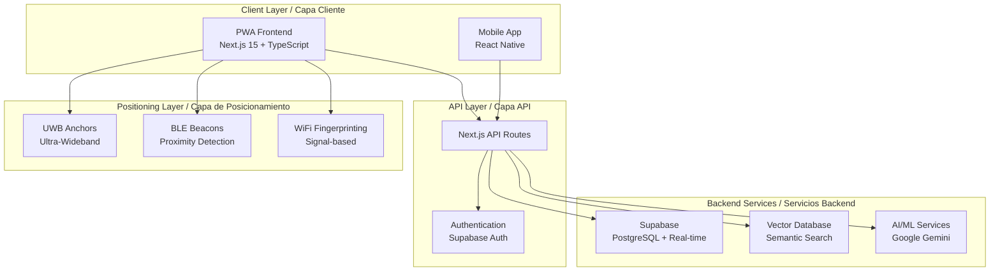

### **Arquitectura de Componentes / Component Architecture**

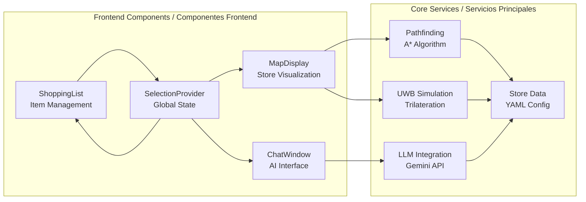

---

## 🔄 **Arquitectura de Flujo de Datos / Data Flow Architecture**

### **Flujo de Solicitud del Usuario / User Request Flow**

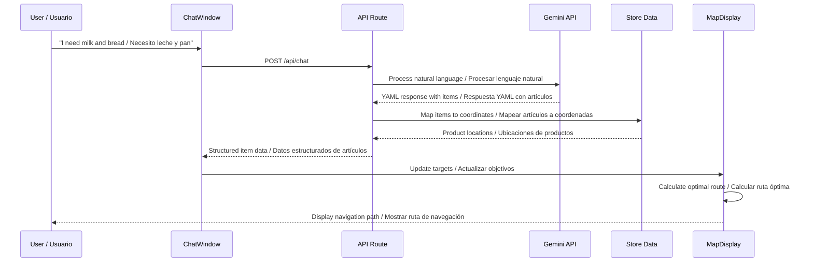

### **Movimiento del Carrito y Posicionamiento / Cart Movement & Positioning**

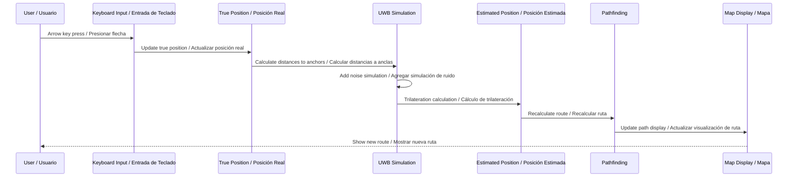

---

## 🤖 **Arquitectura de IA y Machine Learning / AI & Machine Learning Architecture**

### **Sistema RAG (Retrieval-Augmented Generation)**

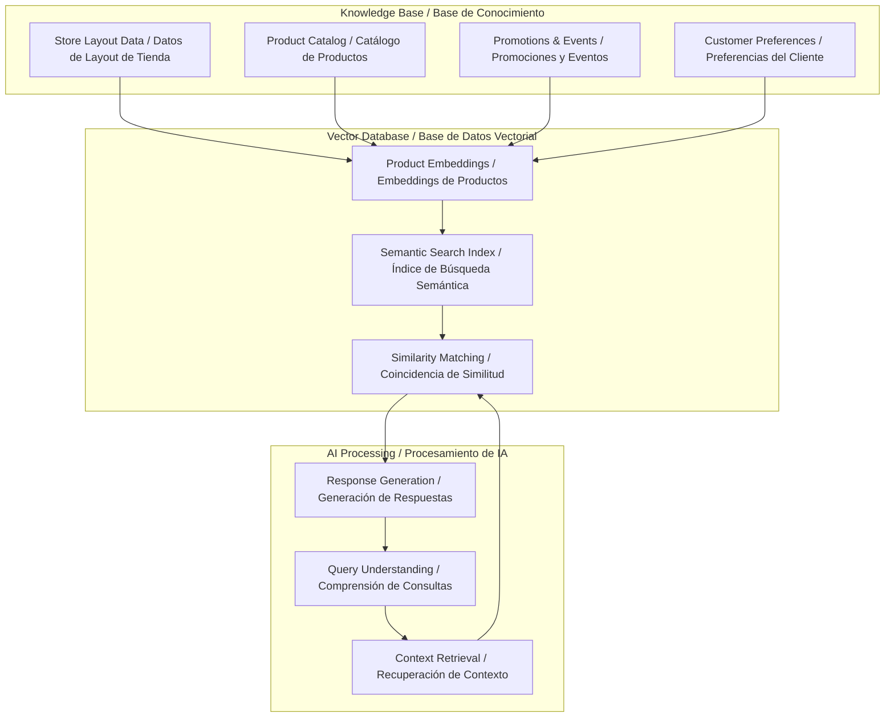

### **Pipeline de Procesamiento de Lenguaje Natural / Natural Language Processing Pipeline**

```mermaid
flowchart LR
    A[User Input / Entrada del Usuario<br/>"I need milk and bread / Necesito leche y pan"] --> B[Intent Recognition / Reconocimiento de Intención]
    B --> C[Entity Extraction / Extracción de Entidades]
    C --> D[Product Mapping / Mapeo de Productos]
    D --> E[Location Resolution / Resolución de Ubicación]
    E --> F[Route Planning / Planificación de Ruta]
    F --> G[Response Generation / Generación de Respuesta]
    G --> H[User Feedback / Retroalimentación del Usuario]
```

---

## 👥 **Flujo de Experiencia del Usuario / User Experience Flow**

### **Viaje Completo del Usuario / Complete User Journey**

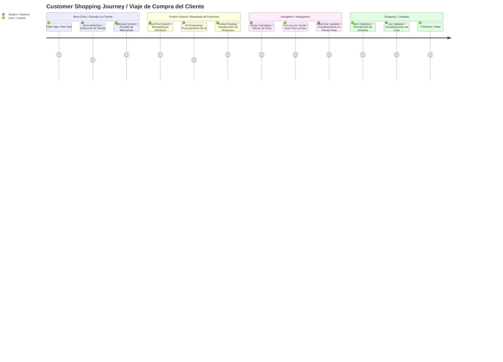

### **Flujo de Diseño Mobile-First / Mobile-First Design Flow**

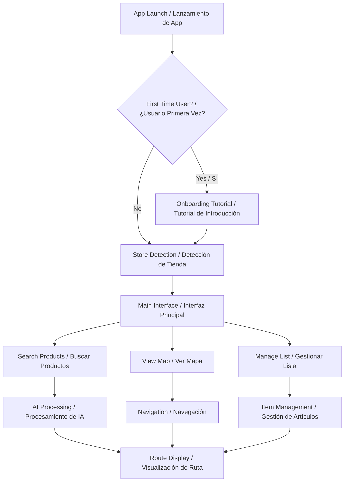

---

## 🛠️ **Implementación Técnica / Technical Implementation**

### **Stack Tecnológico / Technology Stack**

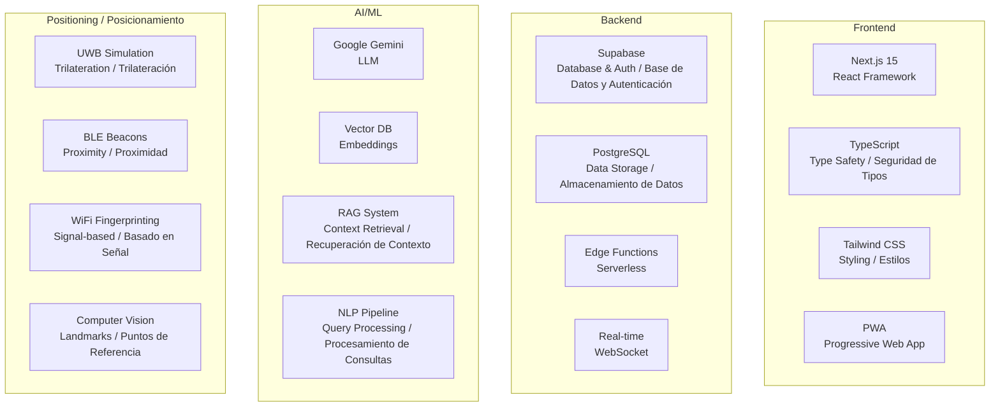

### **Esquema de Base de Datos / Database Schema**

```mermaid
erDiagram
    USER_PROFILES {
        uuid id PK
        string email
        string name
        jsonb preferences
        timestamp created_at
    }
    
    STORES {
        uuid id PK
        string name
        string address
        jsonb layout_data
        point coordinates
        timestamp created_at
    }
    
    PRODUCTS {
        uuid id PK
        string name
        text description
        string category
        string aisle_location
        uuid store_id FK
        point coordinates
        timestamp created_at
    }
    
    NAVIGATION_SESSIONS {
        uuid id PK
        uuid user_id FK
        uuid store_id FK
        timestamp start_time
        timestamp end_time
        jsonb path_data
        timestamp created_at
    }
    
    USER_PROFILES ||--o{ NAVIGATION_SESSIONS : has / tiene
    STORES ||--o{ PRODUCTS : contains / contiene
    STORES ||--o{ NAVIGATION_SESSIONS : hosts / aloja
```

---

## 🎨 **Diseño de Interfaz de Usuario / User Interface Design**

### **Jerarquía de Componentes / Component Hierarchy**

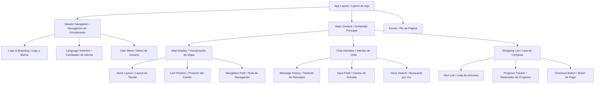

### **Puntos de Quiebre de Diseño Responsivo / Responsive Design Breakpoints**

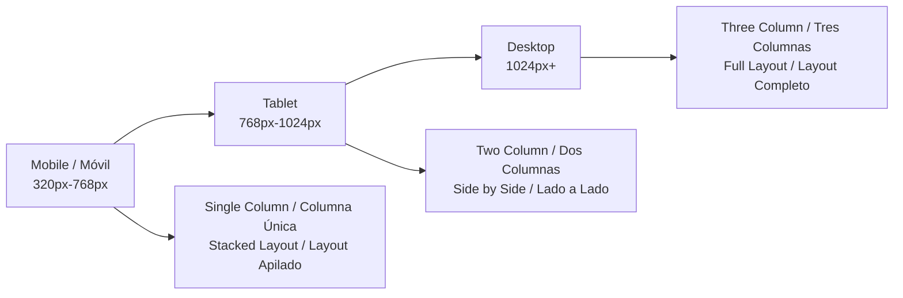

---

## 🚀 **Rendimiento y Escalabilidad / Performance & Scalability**

### **Estrategia de Optimización de Rendimiento / Performance Optimization Strategy**

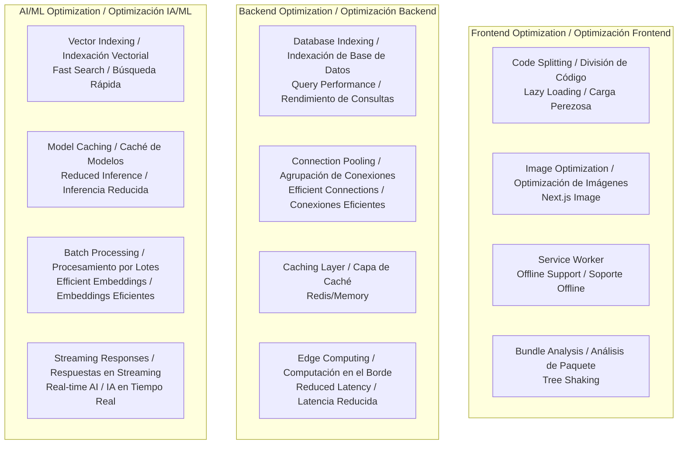

### **Arquitectura de Escalabilidad / Scalability Architecture**

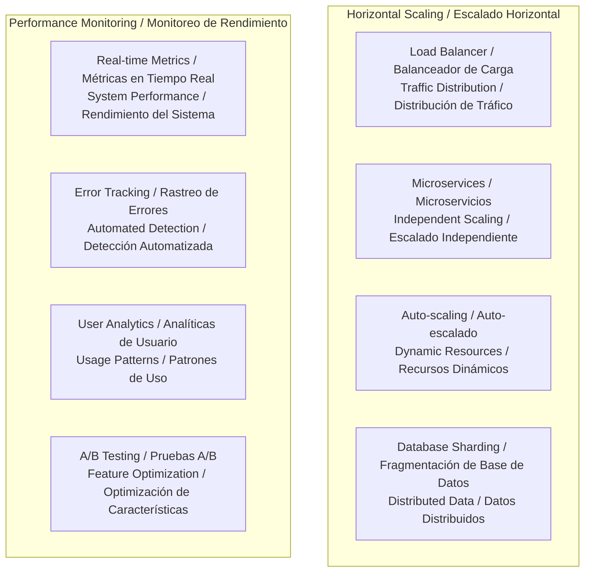

---

## 🔒 **Seguridad y Privacidad / Security & Privacy**

### **Arquitectura de Seguridad / Security Architecture**

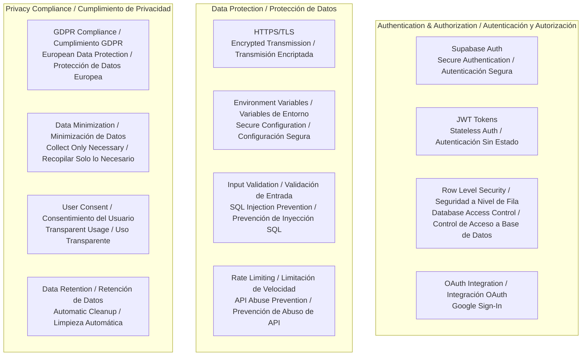

---

## 📊 **Analíticas y Monitoreo / Analytics & Monitoring**

### **Indicadores Clave de Rendimiento / Key Performance Indicators**

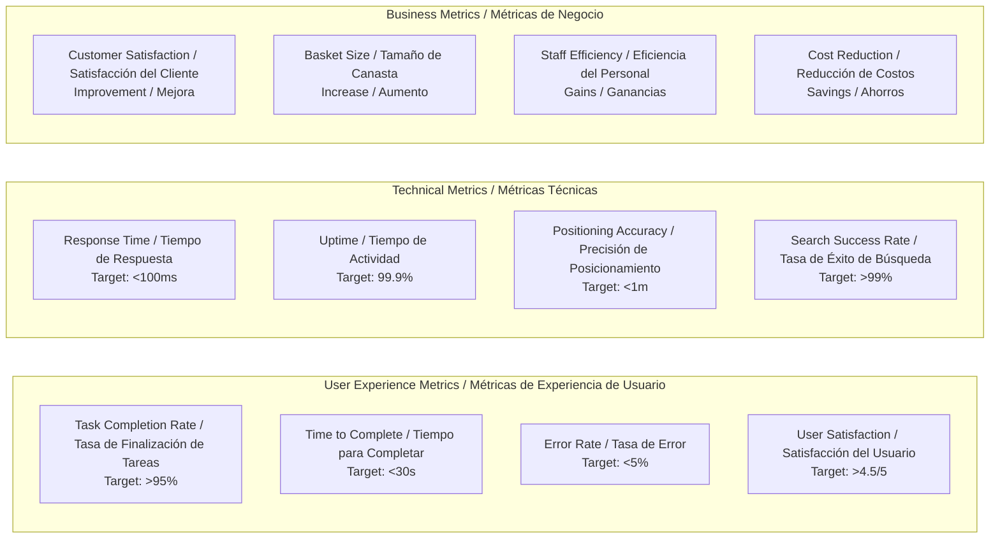

---

## 🗓️ **Hoja de Ruta de Implementación / Implementation Roadmap**

### **Fases de Desarrollo / Development Phases**

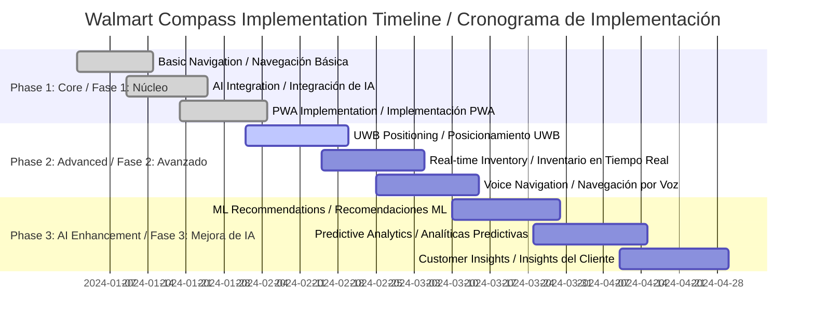

---

## 🏆 **Ventajas Competitivas / Competitive Advantages**

### **Matriz de Innovación / Innovation Matrix**

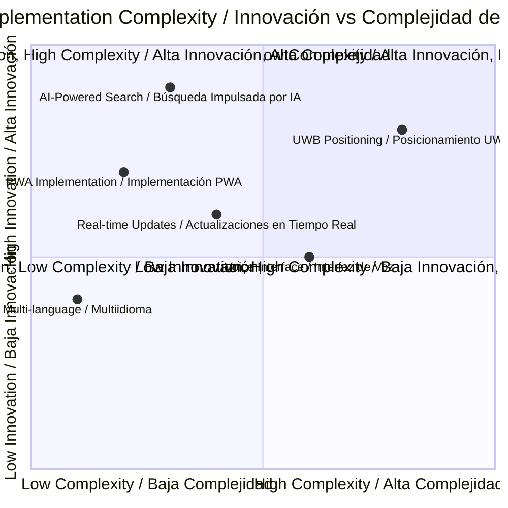

### **Comparación de Características / Feature Comparison**

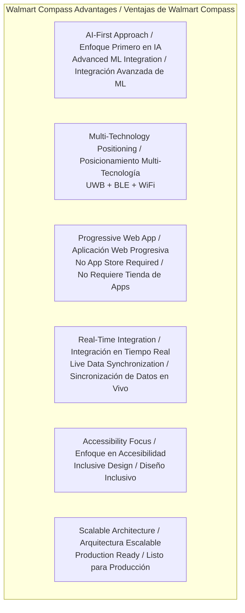

---

## 📞 **Contacto y Recursos / Contact & Resources**

### **Información del Proyecto / Project Information**

**ESPAÑOL:**
- **Nombre del Proyecto:** Walmart Compass
- **Desarrollador:** Angel Undeveloped
- **Email:** angelundeveloped@gmail.com
- **Demo en Vivo:** https://walmart-hackathon-two.vercel.app
- **Repositorio:** https://github.com/angelundeveloped/walmart_hackathon

**ENGLISH:**
- **Project Name:** Walmart Compass
- **Developer:** Angel Undeveloped
- **Email:** angelundeveloped@gmail.com
- **Live Demo:** https://walmart-hackathon-two.vercel.app
- **Repository:** https://github.com/angelundeveloped/walmart_hackathon

### **Enlaces de Documentación / Documentation Links**

**ESPAÑOL:**
- **Arquitectura Técnica:** [TECHNICAL_ARCHITECTURE.md](./TECHNICAL_ARCHITECTURE.md)
- **Diseño de Experiencia de Usuario:** [USER_EXPERIENCE_DESIGN.md](./USER_EXPERIENCE_DESIGN.md)
- **Script de Demo:** [DEMO_SCRIPT.md](./DEMO_SCRIPT.md)
- **Guía de Instalación:** [README.md](./README.md)

**ENGLISH:**
- **Technical Architecture:** [TECHNICAL_ARCHITECTURE.md](./TECHNICAL_ARCHITECTURE.md)
- **User Experience Design:** [USER_EXPERIENCE_DESIGN.md](./USER_EXPERIENCE_DESIGN.md)
- **Demo Script:** [DEMO_SCRIPT.md](./DEMO_SCRIPT.md)
- **Installation Guide:** [README.md](./README.md)

---

## 🎯 **Conclusión / Conclusion**

**ESPAÑOL:**
Walmart Compass representa el futuro de la navegación en tienda, combinando tecnología de IA de vanguardia con diseño centrado en el usuario para crear una experiencia de compra incomparable. Nuestra solución aborda todos los requisitos del desafío mientras proporciona un valor comercial significativo a través de una mayor satisfacción del cliente, eficiencia operacional e insights basados en datos.

El sistema está listo para producción y es escalable, con el potencial de transformar la experiencia de compra en todas las tiendas Walmart en México y más allá.

**ENGLISH:**
Walmart Compass represents the future of in-store navigation, combining cutting-edge AI technology with user-centered design to create an unparalleled shopping experience. Our solution addresses all challenge requirements while providing significant business value through improved customer satisfaction, operational efficiency, and data-driven insights.

The system is production-ready and scalable, with the potential to transform the shopping experience across all Walmart stores in México and beyond.

---

*Esta documentación consolidada bilingüe proporciona una visión completa del sistema Walmart Compass, desde la arquitectura de alto nivel hasta los detalles específicos de implementación, todo visualizado a través de diagramas interactivos de Mermaid.*

*This consolidated bilingual documentation provides a complete overview of the Walmart Compass system, from high-level architecture to detailed implementation specifics, all visualized through interactive Mermaid diagrams.*
